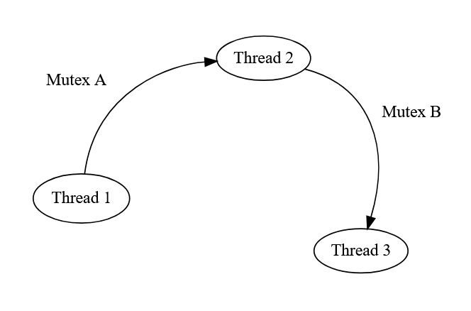
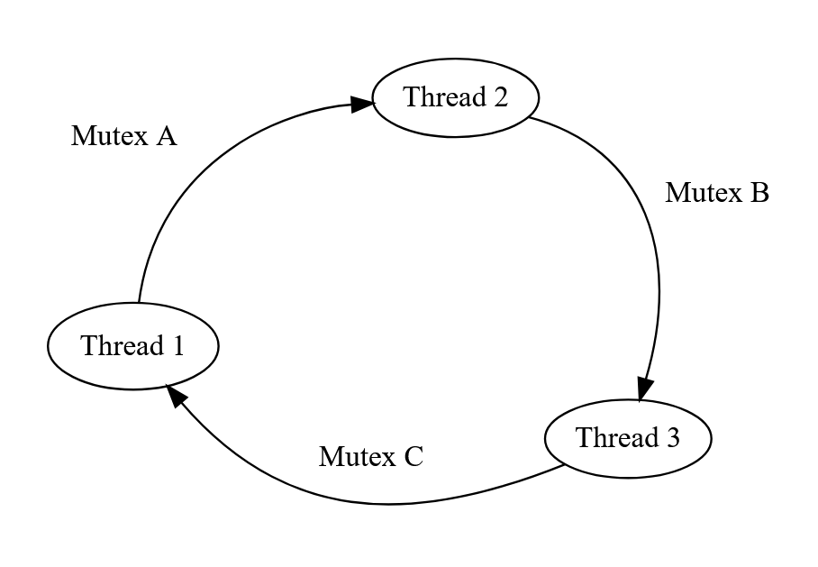

## Explications sur l'outil

<p align="justify">
&nbsp;&nbsp;&nbsp;&nbsp;&nbsp;&nbsp;L’API fournit à l’utilisateur une classe Dispatch Queue récursive en C++ dont il peut configurer le nombre de thread alloué. S’il le souhaite, il peut activer la journalisation de son programme et instrumenter son programme avec les methodes de la classe, ce qui lui permettra d’obtenir un fichier de logs au format json, qu’il pourra à posteriori visualiser dans une GUI avec autre programme Python fourni. 
</p>

### L'API

<p align="justify">
&nbsp;&nbsp;&nbsp;&nbsp;&nbsp;&nbsp;Nous avons implémenté deux modes de journalisation. 
Un “classique” le plus fidèle à l'exécution réelle du programme et exporte le fichier à la fin de l'exécution. Notamment pour analyser en détail l’ordre des “jobs” (fonctions que l'utilisateur pousse dans la Dispatch Queue) dans une optique d’optimisation de la parallélisation de son programme. Mais ce mode ne permet donc pas la journalisation lors d’interblocage, puisque la journalisation se fait uniquement une fois le programme terminé. L’API permet de journaliser dans quel job, et dans quel thread les mutex qui sont en position d'attente ou en possession. Pour ce faire, on fournit à l’utilisateur des méthodes permettant de signaler lorsque le mutex est position d’attente, en possession ou bien libéré en leur donnant un nom. Si l’utilisateur en a besoin, lui est fourni également une manière signaler des balises dans son code, ainsi il pourra visualiser dans la partie graphique quand sera effectuée les portions de code qu’il aura désignées.   

&nbsp;&nbsp;&nbsp;&nbsp;&nbsp;&nbsp;Un mode “deadlock free” ou “RealTime” permet d’effectuer la journalisation en temps réel. Cela affecte donc légèrement la parallélisation du programme puisqu’il perd du temps à écrire le fichier json régulièrement. Quoi qu’il en soit ce mode ne sert pas à optimiser le programme mais est uniquement fait pour détecter des deadlock et comprendre leur origine. Dans ce mode il y a même détecteur automatique de deadlock “simples” (spiderman) à l'exécution permettant d'interrompre le programme lorsque le deadlock se produit et de journaliser la demande circulaire de mutex entre les threads.  
</p>

### Fonctionnement 
#### Detection de Deadlock (mutex bloquant)
<p align="justify">
En considérant les threads comme les sommets d’un graphe, et l’attente entre threads les arêtes orientés entre les sommets on peut simplifier ce problème à une détection de cycle au sein du graphe. Si un thread attend un mutex et qu’un autre le possède on trace une arête du premier vers le second. Ainsi on se rend compte qu’il y a au maximum une arête sortante à chaque sommet.
</p>

| Threads | Thread 1 | Thread 2 | Thread 3 |
| ------- | :------: | :------: | :------: |
| Demande | Mutex A  | Mutex B  |    /     |

| Mutex       | Mutex A  | Mutex B  | Mutex C |
| ----------- | :------: | :------: | :-----: |
| Possédé par | Thread 1 | Thread 2 |    /    |




Exemple de graphe d’attente en cas de deadlock 

| Threads | Thread 1 | Thread 2 | Thread 3 |
| ------- | :------: | :------: | :------: |
| Demande | Mutex A  | Mutex B  | Mutex C  |

| Mutex       | Mutex A  | Mutex B  | Mutex C  |
| ----------- | :------: | :------: | :------: |
| Possédé par | Thread 1 | Thread 2 | Thread 3 |




<p align="justify">
En bref, ce sont les conditions nécessaires pour appliquer l'algorithme de Floyd  pour la détection de cycle (aussi appelé algorithme du Lièvre et de la Tortue). Cet algorithme est capable de détecter des cycles dans un graphe orienté en O(n), n étant le nombre de sommets du graphe (ici le nombre de threads). Ainsi à chaque fois qu’un thread récupère ou demande un mutex on met à jour le graphe en O(n) et applique une détection de cycle O(n). Comme le nombre de thread maximum est petit (8-16-32 selon les machines) il s’agit d'opérations légères ce qui est crucial puisque ces opérations sont effectuées à chaque changement d’état des mutex, or on souhaite que les mutex soient détenus le moins longtemps possible pour la meilleur parallélisation possible.  La structure de donnée utilisée pour enregistrer le graphe est un simple tableau dont les indices désignent les sommets et les valeurs des cellules l'arête sortante de ces sommets. On convertit donc les identifiants des thread en indice pour faire la correspondance entre ces indices et les threads. Ces quelques opérations, permettent une interruption automatique du programme s’il détecte une attente circulaire de mutex elle sera mise en valeur dans l’interface graphique. 
</p>

#### Export des Logs

L’export des logs au format Json se fait grâce à une bibliothèque open source trouvée sur GitHub  https://json.nlohmann.me/ 
<p align="justify">
Pour l’export des logs en temps réel le programme utilise un thread supplémentaire effectuant uniquement cette tâche. Nous avons réalisé trop tard que ce n’était peut être pas la façon la plus judicieuse de le faire, puisque dans certains scénarios l’utilisateur pourrait avoir un programme optimisé pour utiliser le maximum de thread que sa machine lui permet ce qui impliquerait qu’on pourrait utiliser un thread de trop et casser son optimisation.
</p>

### Usage de L'API
<p align="justify">
Le détail des spécification des méthodes de l’API sont disponible dans la documentation en annexe néanmoins voici quelques méthodes importantes après avoir créer la dispatchQ :
</p>

#### Mutex
<p align="justify">
Pour la journalisation des Mutex on laisse à disposition 3 méthodes, pour déclarer lorsqu’un mutex est demandé, possédé, libéré 
</p>

1. MutexNeed : Enregistre lorsqu'un thread est en attente du mutex renseigné.
```cpp
std::mutex mtx;
MutexNeed(dispatchQueue, "mtx");
mtx.lock();
```
2. MutexHave: Enregistre lorsque le mutex est récupéré.
```cpp
mtx.lock();
MutexHave(dispatchQueue, "mtx");
// Critical section
```
3. MutexFree: Enregistre lorsque le mutex est libéré.
```cpp
mtx.unlock();
MutexFree(dispatchQueue, "mtx");
```

Il faudra veiller à bien garder le même nom de mutex pour les trois étapes. Voici un example d'utilisation:
```cpp
    {
        // Log avant le verrou du mutex
        MutexNeed(dispatchQueue, "MyCounterMutex");  
        std::lock_guard<std::mutex> lock(myMutex);
        // Log Apres le verrou
        MutexHave(dispatchQueue, "MyCounterMutex");  
        
        // Simulation de travail
        std::this_thread::sleep_for( std::chrono::milliseconds(100) );
         
        // Log avant la liberation du mutex
        MutexFree(dispatchQueue, "MyCounterMutex"); 
    };

```

#### Tag (Balises)
<p align="justify">
Les tags permettent de mettre en evidence dans la gui une portion de code dont le developpeur a besoin d'identifier lorsqu'elle est exécuté. Pour ce faire simplement deux methodes TagStart, TagStop. Il faudra veiller à bien utiliser le même nom pour signaler le debut et la fin de la balise.
</p>

```cpp
{   
    TagStart(dispatchQueue, "Tag");
    {
        // Simulation de travail, partie du code que le developpeur cherche à identifier dans l'interface
        std::this_thread::sleep_for(std::chrono::milliseconds(10));
    }
    TagStop(dispatchQueue, "Tag");
}

```

CF voir dans la partie gui la representation de ces elements graphques
