# MEDUSA PROJECT


## About
MEDUSA PROJECT aims to debug C++ multithreaded programs by visualizing threads executions. It provides a C++ Backend Recursive Dispatch Queue API accessible to the user. This API includes functionalities to log user code at different levels and generates a JSON file. This file is then used by a Python-based graphical user interface (GUI) to visualize the program’s execution.


## Table of contents

- 🪧 [About](#about)
- 📦 [System Requirements](#system-requirements)
- 🚀 [Installing](#installing)
- 🛠️ [Utilisation](#utilisation)
    * [Backend](#backend)
    * [Frontend (GUI)](#frontend-gui)
- 📝 [Licence](#licence)


## Building
### Supported Operating Systems
* Linux (g++ / clang)

* macOS (XCode)

* Windows (Visual Studio)

## System Requirements
* C++17 Compiler
* Python 3.x

## Installing
`git clone https://github.com/MITTALsag/MEDUSA.git`    


## Utilisation


### Backend
The backend program is a C++ code that provides a Recursive Dispatch Queue (DispatchQ class).  
It manages a pool of worker threads to execute tasks asynchronously. It provides functionality for dispatching tasks, managing thread pools, and logging task execution details. Here's a breakdown of how to use the backend part of this code :  

#### Initialization  : 
To start using the DispatchQ, you need to create an instance of it. You can specify the name of the queue and the number of worker threads.
```cpp
// Creates a queue named "MyQueue" with 4 worker threads
LzAsync::DispatchQ dispatchQueue("MyQueue", 4);
```
---


#### Dispatch a job
These are functions to put a job in the dispatch queue. Your job can also dispatch other jobs recursively. Make sure your algorithm has a proper termination condition.
```cpp
// Here func is std::function<void(void)>
// Where func_and_name is std::pair<const std::string, func>
void dispatch( const func & pJob, const string & pName="<unnamed>" );
void dispatch( const vector<func> & pJobs, const string & pName="<unnamed>" );
void dispatch( const List<func> & pJobs, const string & pName="<unnamed>" );
void dispatch( func_and_name && pNamedJob );
void dispatch( const List<func_and_name> & pNamedJobs );

```
#### Example Usage :   
dispatch the function lambda (that call "RecursiveCount") to the dispatch queue  
(see TestRecursiveDQ__Counter in DispatchQ_UnitTest)
```cpp
 spTestAsyncDQ->dispatch
    ( 
        [&]{ RecursiveCount( lInts, lSum ); }, 
        "RecursiveCount : with size = " + std::to_string(lInts->size())
    );
```

---


#### Managing the Thread Pool
You can manage the thread pool using the following methods :

1. Wait for Idle :
```cpp
// Blocking waits until the Queue is empty AND no more workers are doing any work
dispatchQueue.waitForIdle(bool pRestart); 
```
2. Complete Jobs :
```cpp
// Blocking waits for proper termination of all jobs in queue
dispatchQueue.completeJobs(bool pRestart); 
```

3. Interrupt Jobs :
```cpp
// Blocking waits for proper termination of all jobs in queue
dispatchQueue.interruptJobs(bool pRestart); 
```

If `pRestart` is at true, the dispatch queue will be restarted with same number of workers.   
⚠️ Warning : Those functions are BLOCKING.

4. Restart Pool :
```cpp
// Will INTERRUPT all jobs, and terminate all current worker threads before restarting. Here restart with 8 threads
dispatchQueue.restartPool(8);
```  


---


#### Logging and Exporting Logs
Logs are automatically managed based on the logging mode specified when starting profiling. Logs are stored in JSON format and include details about task execution, mutex states, and tags.  
Logs can be exported in two modes :
1. END Mode : 
```cpp
dispatchQueue.startProfiling("/path/to/logs");
// Or
dispatchQueue.startProfiling("/path/to/logs", LzAsync::LogsMod::END);
```
Logs are exported at the end of execution as a `logs.json` file in the specified path.  
⚠️ Warning : The path must exist.


2. REALTIME Mode : 
```cpp
dispatchQueue.startProfiling("/path/to/logs", LzAsync::LogsMod::REALTIME);
```
Logs are exported in real-time in `"/path/to/logs"` directory. It exports the last 10 modifications. If the user wants to have more or minus last modifications he can modify the `constexpr` variable `NB_FILE` in `DispatchQ::ExportRealTimeJson` function. 
The format of the files are `"_LOG_<TimeStamp>.json"` where `TimeStamp` is the time since the start of profiling.  
⚠️ Warning : In real-time logs the program deletes all files matching the naming format.


To stop profiling during the execution you can call :
```cpp
dispatchQueue.stopProfiling();
```
After that you can re-call `DispatchQ::startProfiling(...)`.  
⚠️ Warning (only on END mod) : if you call `DispatchQ::stopProfiling()` and then `DispatchQ::startProfiling(...)` the previous logs will be deleted, so you must call `DispatchQ::ExportLogsJson(std::string pToDir)` EXPICITLY before re-call `DispatchQ::startProfiling(...)`.

#### Example Usage
Here's an example of how you might use the DispatchQ class :

```cpp
// Import the DispatchQ header
#include "DispatchQ.h"

void VerySimpleTest()
{
    // Create a DispatchQ with the name "VerySimpleTest" and 3 worker threads
    LzAsync::DispatchQ dispatchQ("VerySimpleTest", 3);

    // Define a small job (simulate some short work with sleep)
    auto Smalljob = [&]()
    {
        std::this_thread::sleep_for(std::chrono::milliseconds(50));
    };
    
    // Define a bigger job that will itself dispatch more small jobs
    auto Bigjob = [&]()
    {
        std::this_thread::sleep_for(std::chrono::milliseconds(100));

        // Dynamically dispatch 3 small jobs from within this job
        dispatchQ.dispatch(Smalljob, "Fifth Dispatch");
        dispatchQ.dispatch(Smalljob, "Sixth Dispatch");
        dispatchQ.dispatch(Smalljob, "Seventh Dispatch");
    };

    // Define a job that dispatches other jobs, including Bigjob
    auto job2 = [&]()
    {
        std::this_thread::sleep_for(std::chrono::milliseconds(50));

        dispatchQ.dispatch(Smalljob, "Second Dispatch");
        dispatchQ.dispatch(Smalljob, "Third Dispatch");
        dispatchQ.dispatch(Bigjob, "Fourth Dispatch");
    };

    // Start profiling and specify output directory for logs
    dispatchQ.startProfiling("./json_files/VerySimpleTest");

    // Dispatch the main job
    dispatchQ.dispatch(job2, "First Dispatch");

    // Wait until all jobs are finished
    dispatchQ.waitForIdle(false);
}
```

This will generate `"./json_files/VerySimpleTest.json"`.

This is what you should see in the GUI:  
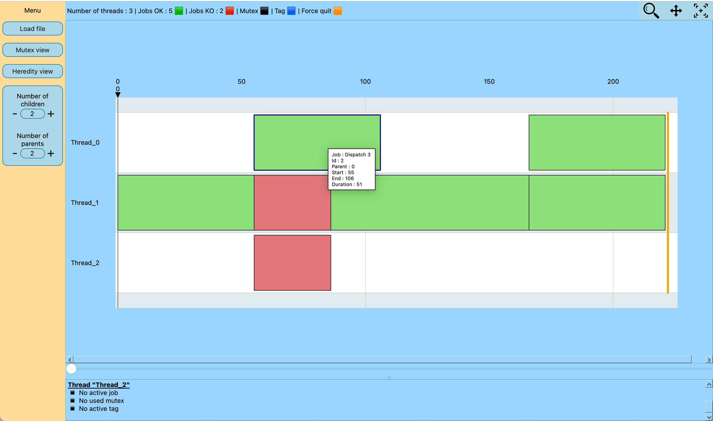  
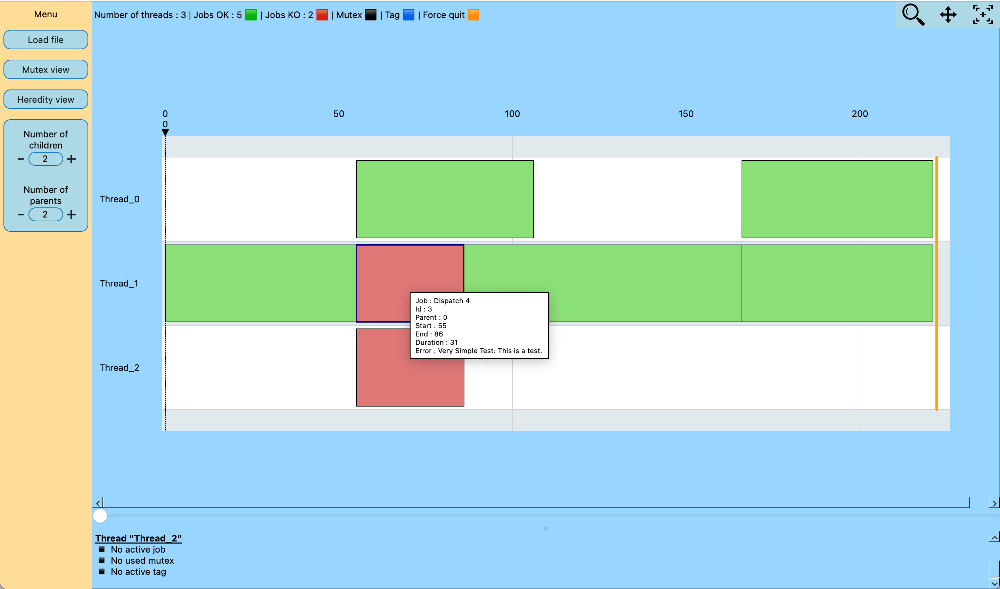

> **What You See:**  
> * Each rectangle represents a job.  
> * 🟩 **Green** rectangle indicates that the job completed successfully.  
> * 🟥 **Red** rectangle indicates that the job threw an exception, which was caught by the dispatch queue.
> * When you hover over a rectangle, you will see detailed information about the job:  
> * Job name  
> * Job ID (see [Heredity](#heredity))  
> * Parent job ID (see [Heredity](#heredity))  
> * Start and stop times  
> * Job duration  
> * (For red rectangles) Any caught exceptions


---


#### Mutexes Management
The DispatchQ class provides a way to manage and log mutex states. This is useful for debugging and profiling, especially in multi-threaded environments where mutex behavior is critical.  
Here's how you can use the mutex management features :

1. Mutex Need : Log when a thread is about to attempt to lock a mutex.
```cpp
std::mutex mtx;
MutexNeed(dispatchQueue, "mtx");
mtx.lock();
```

2. Mutex Have: Log when a thread has successfully locked a mutex.
```cpp
mtx.lock();
MutexHave(dispatchQueue, "mtx");
// Critical section
```

3. Mutex Free: Log when a thread has unlocked a mutex.
```cpp
mtx.unlock();
MutexFree(dispatchQueue, "mtx");
```
These functions help track the lifecycle of mutex operations, which can be useful for identifying potential deadlocks or performance bottlenecks.  
⚠️⚠️ WARNING : You must use **ALL three functions** to log a mutex and the name of the mutex (here `"mtx"`) must be **EXACTLY the same in all Need, Have and Free for one mutex.**  
Of course it is possible to put several mutexes and then each of them must have a **unique name.**  

#### Example Usage : 
Here's an example of how you might use mutex managment : (see DispatchQ_UnitTest.cpp)
```cpp
#include "DispatchQ.h"
#include <mutex>

void SimpleMutexTest() 
{
    LzAsync::DispatchQ queue("SimpleMutex", 2);
    queue.startProfiling("./json_files/SimpleMutex");
    
    std::mutex myMutex;

    auto jobMutex = [&] 
    {
        // Log before lock
        MutexNeed(queue, "MyCounterMutex");  
        std::lock_guard<std::mutex> lock(myMutex);
        // Log after lock
        MutexHave(queue, "MyCounterMutex");  
        
        // Simulate some work
        std::this_thread::sleep_for( std::chrono::milliseconds(100) );
         
        // Log after the unlock
        MutexFree(queue, "MyCounterMutex"); 
    };


    // Jobs with mutex
    queue.dispatch(jobMutex, "IncrementTask 1");
    queue.dispatch(jobMutex, "IncrementTask 2");

    queue.waitForIdle(false);

}
```

This is what you should see in the GUI:  
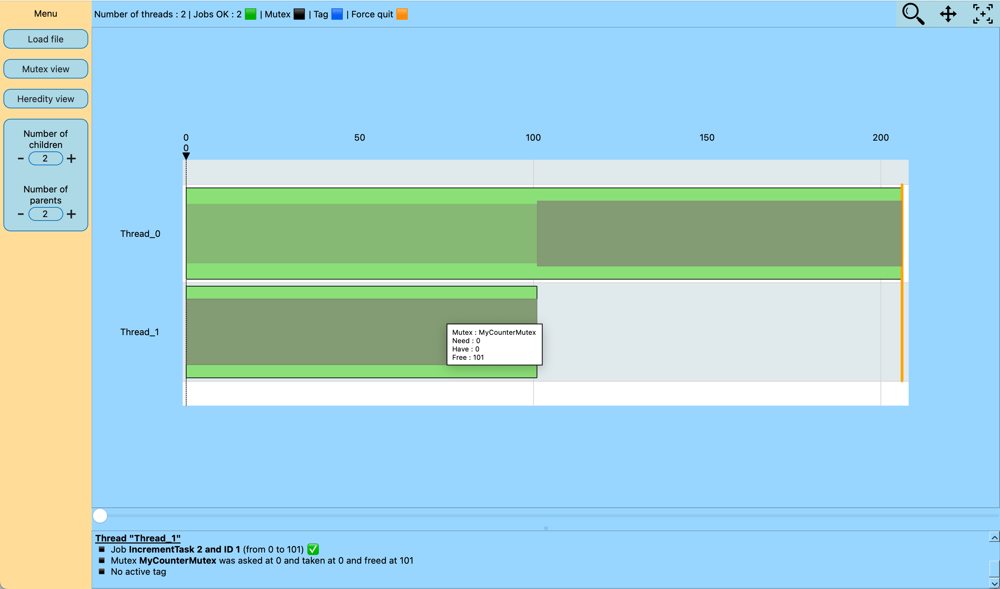  
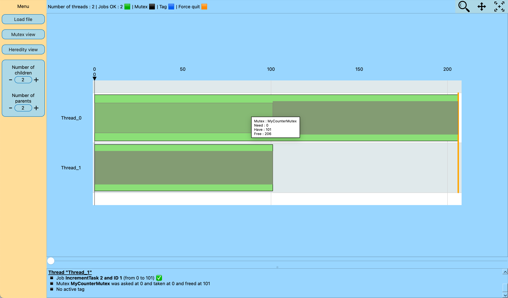

> **What You See:**
> - There are two jobs, and inside each job, you can see grey rectangles representing mutex activity.  
> - In this example, **Thread 2** acquires the mutex at time `0` and releases it at `101`. **Thread 1** starts trying to acquire the mutex at time `0`, obtains it at `101`, and releases it at `206`.
>
> * When you hover over a mutex rectangle, the following information is displayed:  
>    - Name of the mutex  
>    - Time when the thread started trying to acquire it  
>    - Time when the mutex was acquired  
>    - Time when it was released
>    - The **smaller, lighter grey** rectangle indicates the waiting period before acquiring the mutex.  
>    - The **larger, darker grey** rectangle shows the time span during which the mutex was held, ending when the thread released it.

---


#### Section Management (Tags)
Tags in the DispatchQ class allow you to mark and measure specific sections of your code. This can be useful for profiling and understanding the execution flow of your application.  
Here's how you can use tags :

1. Tag Start: Mark the beginning of a section.
```cpp
TagStart(dispatchQueue, "MySection");
// Code section to profile
```

2. Tag Stop: Mark the end of a section.
```cpp
// Code section to profile
TagStop(dispatchQueue, "MySection");
```
These tags help in analyzing the time spent in different sections of your code, which can be useful for performance optimization.  
⚠️⚠️ WARNING : You have to use **ALL these two functions** to log a tag and the name of the section (here `"MySection"`) must be **EXACTLY the same in all two `TagStart` and `TagStop` functions of one section**.  
Of course it is possible to put several tags and then each of them must have a unique name.  
Be careful when using tags in nested loops: ensure `TagStart` and `TagStop` are properly paired and scoped.

#### Example Usage : 
Here's an example of how you might use mutex managment : (see DispatchQ_UnitTest.cpp)
```cpp
#include "DispatchQ.h"

void TestTagSimple()
{
    // Create a new dispatch queue
    LzAsync::DispatchQ dispatchQ("TestTagSimple", 1);


    auto jobTag = [&]() 
    {
        for (int i = 0; i< 10 ; i++)
        {   
            // Simulate some work
            std::this_thread::sleep_for(std::chrono::milliseconds(10));


            TagStart(dispatchQ, "Tag");
            {
                // Simulate some work
                std::this_thread::sleep_for(std::chrono::milliseconds(10));
            }
            TagStop(dispatchQ, "Tag");

        }

    };


    // Start profiling
    dispatchQ.startProfiling("./json_files/TestTagSimple");

    // Dispatch a job with a tag
    dispatchQ.dispatch(jobTag, "Job with Tag");

    // Wait for all jobs to finish
    dispatchQ.waitForIdle(false);
}
```

This is what you should see in the GUI:  
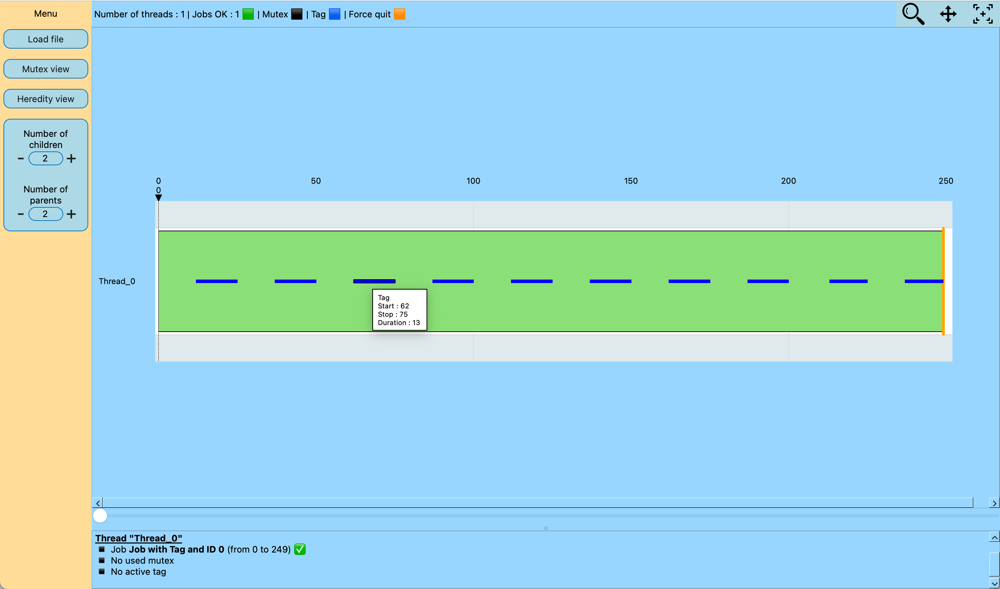

> **What You See:**
> * Each **blue line** represents a tagged section of your code that was logged.
> * When you hover over a blue line, you will see detailed information about the tag:
>   - Tag name  
>   - Start and stop timestamps  
>   - Duration of the tagged section


---


#### Real-Time Mode:

In Real-Time Logs mode, JSON logs are continuously generated during your program’s execution.  
Each time a job completes, the logs are updated to reflect the current state of execution.

Additionally, if no job has finished within the last 10 seconds, the system automatically triggers an update.  
This ensures that the visual representation remains synchronized with the actual program state, even during idle periods.


#### Example Usage : 
Here's an example of how you might use Real-Time logs : 
(see DispatchQ_UnitTest.cpp)
```cpp
#include "DispatchQ.h"

void SimpleTest()
{
    // Create a new dispatch queue
    LzAsync::DispatchQ dispatchQ("SimpleTest", 3);

    bool pInstant = true;
    int lcount = 0;

    std::function<void(void)> lJobDispatch;
    lJobDispatch = [&]()
    {
        bool localInstant = pInstant;

        dispatchQ.dispatch([localInstant]() {
            if (!localInstant)
                std::this_thread::sleep_for(std::chrono::milliseconds(100));
        }, "Job OK " + std::to_string(lcount));

        dispatchQ.dispatch([localInstant]() {
            if (!localInstant)
                std::this_thread::sleep_for(std::chrono::milliseconds(100));
            throw std::runtime_error("Simple Test: This is a test.");
        }, "Job KO " + std::to_string(lcount));

        lcount++;
        pInstant = !pInstant;

        if (lcount < 10)
            lJobDispatch();
    };

    dispatchQ.startProfiling("./json_files/SimpleTest", LzAsync::LogsMod::REALTIME);
    lJobDispatch();

    // Wait for all jobs to finish
    dispatchQ.waitForIdle(false);
}
```
This is what you should see in the GUI in Real-Time Mode:  
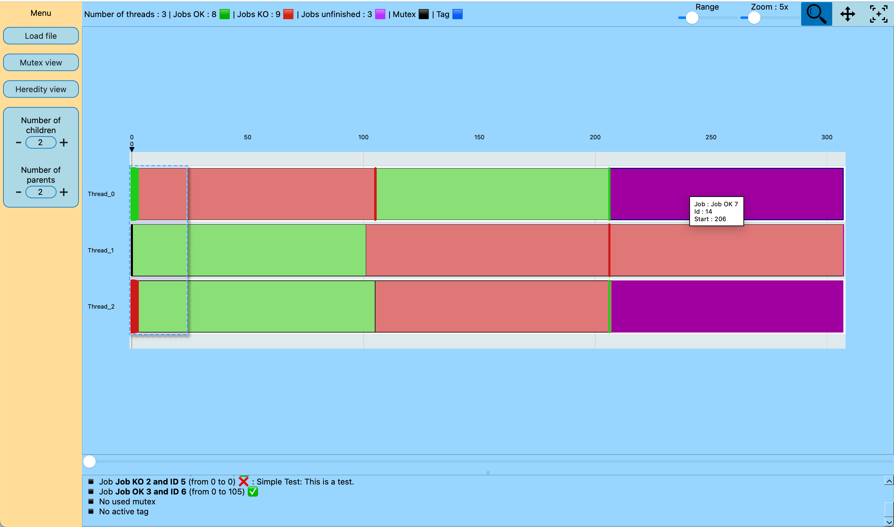

> **What You See:**
> * As before, each rectangle represents a job:  
  >     - 🟩 Green indicates a successful job  
  >     - 🟥 Red indicates a job that threw an exception  
  >     - 🟪 Purple indicates a job that is still running  
> * The flashing green and red lines represent successful and failed jobs that completed in less than a millisecond.  
> * If you hover over an unfinished (purple) job, you will see:  
>   - The job's name  
>   - Its ID  
>   - The start time

---


##### DeadLocks:
In Real-Time Mode, a deadlock detector is enabled by default.  
It detects deadlocks caused by cyclic mutex locks and will terminate the program if one is found.


#### Example Usage : 
Here's an example of how you might use Real-Time logs : 
(see DispatchQ_UnitTest.cpp)
```cpp
void TestDeadlock1WithDispatchQ() 
{
    // Creat a 2 thread Dispatch queue
    LzAsync::DispatchQ dispatchQ("DeadlockTestQ", 2);

    // Share Mutexes that will cause the deadlock
    std::mutex mutexA, mutexB;

    // Job 1 : take mutexA then try to take mutexB
    auto job1 = [&]() {
        MutexNeed(dispatchQ, "mutexA");
        std::unique_lock<std::mutex> lockA(mutexA);
        MutexHave(dispatchQ, "mutexA");

        std::this_thread::sleep_for(std::chrono::milliseconds(100)); // Simulate some work

        // Try to take mutexB but block because job2 have it
        MutexNeed(dispatchQ, "mutexB");
        std::unique_lock<std::mutex> lockB(mutexB);
        MutexHave(dispatchQ, "mutexB");


        MutexFree(dispatchQ, "mutexA");
        MutexFree(dispatchQ, "mutexB");
    };

    // Job 2 : take mutexB then try to take mutexA
    auto job2 = [&]() {
        MutexNeed(dispatchQ, "mutexB");
        std::unique_lock<std::mutex> lockB(mutexB);
        MutexHave(dispatchQ, "mutexB");

        std::this_thread::sleep_for(std::chrono::milliseconds(100)); // Simulate some work

        // Try to take mutexA but block because job1 have it
        MutexNeed(dispatchQ, "mutexA");
        std::unique_lock<std::mutex> lockA(mutexA);
        MutexHave(dispatchQ, "mutexA");

        MutexFree(dispatchQ, "mutexB");
        MutexFree(dispatchQ, "mutexA");
    };


    dispatchQ.startProfiling("./json_files/Deadlock1RealTimeTest", LzAsync::LogsMod::REALTIME);

    dispatchQ.dispatch(job1, "Job1_Deadlock");
    dispatchQ.dispatch(job2, "Job2_Deadlock");

    dispatchQ.interruptJobs(false);
    std::cout << "this line will never be printed" << std::endl;

}
```
This is what you should see in the GUI in Real Time Mode:  
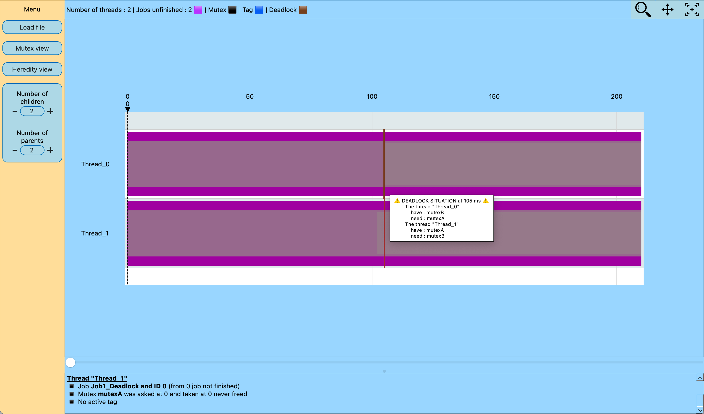

> **What You See:**  
> * We can see that the two threads have not finished their jobs due to the deadlock.  
> * Some mutexes are held by thread 1 and thread 2.  
> * A red line indicates where the deadlock was detected.  
> * Hovering your mouse over this red line shows a tooltip with detailed information about the deadlock.

---


### Frontend (GUI)

This section explains the main functionalities of the GUI and how it can help you debug your code.

The main window is organized as follows:

---

#### 1. Central Area: Execution Timeline

This area displays threads as horizontal lines, with jobs shown as colored rectangles indicating their state, positioned along a timeline in milliseconds. If you hover your mouse over a job, mutex, or tag, you will see information related to the hovered object.


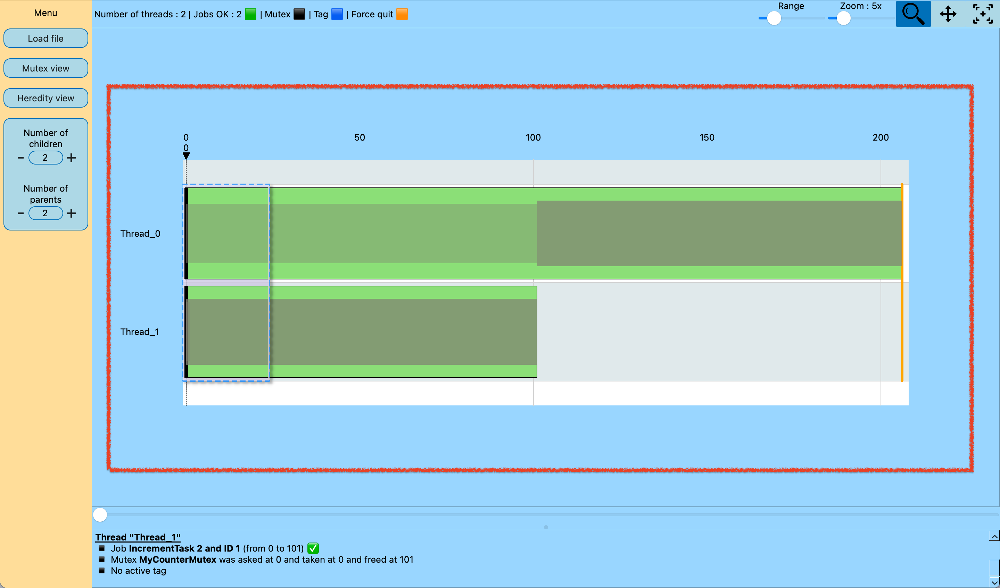

**Animated example:**  


---

- **Time Navigation Slider**  
Allows scrolling through the timeline.
It is also used in other funcionnalities we will see later. 

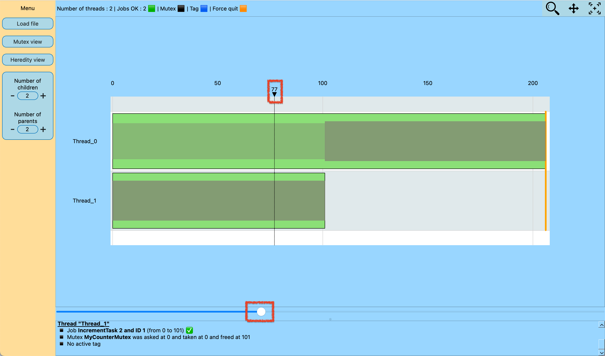


**Animated example:**  


---

#### 2. Top Toolbar
- **Zoom Mode Button**  
Toggles between panoramic view (time scale adjusted to show everything) and compressed view (time scale squeezed). 

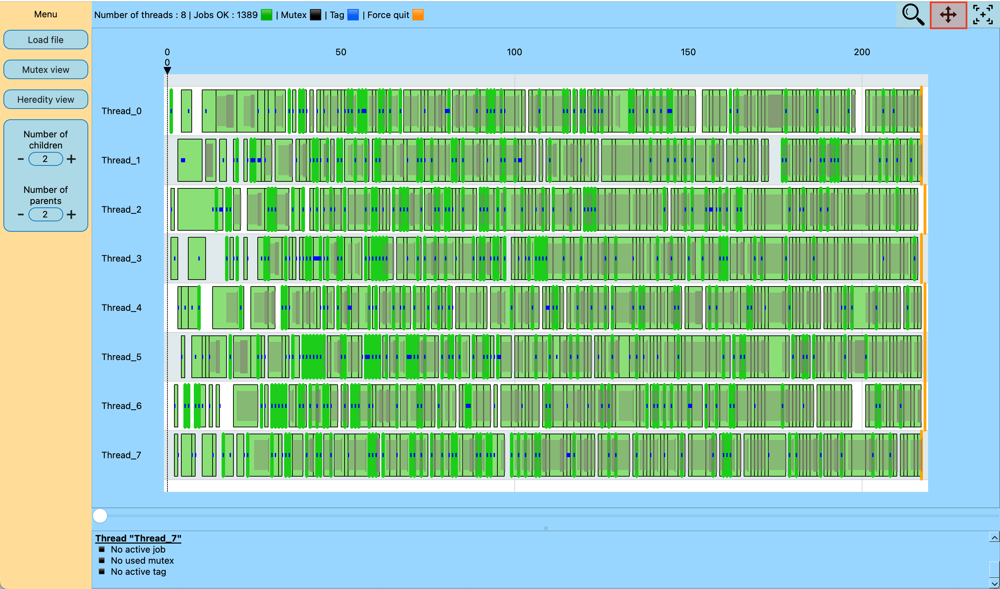

 
**Animated example:**  


---

- **Reset Zoom Button**  
Resets the zoom and timeline configuration back to the default state. 


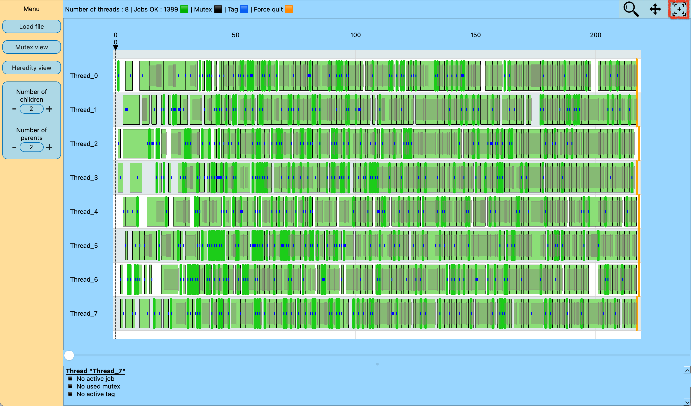

 
**Animated example:**  


---

- **Loop Zoom Button**  
Enables or disables loop zoom mode (enable by defalut).
When enabled, two sliders appear:  
    - One slider to define the time range of the zoom  
    - One slider to adjust the zoom amount (2x to 20x)  

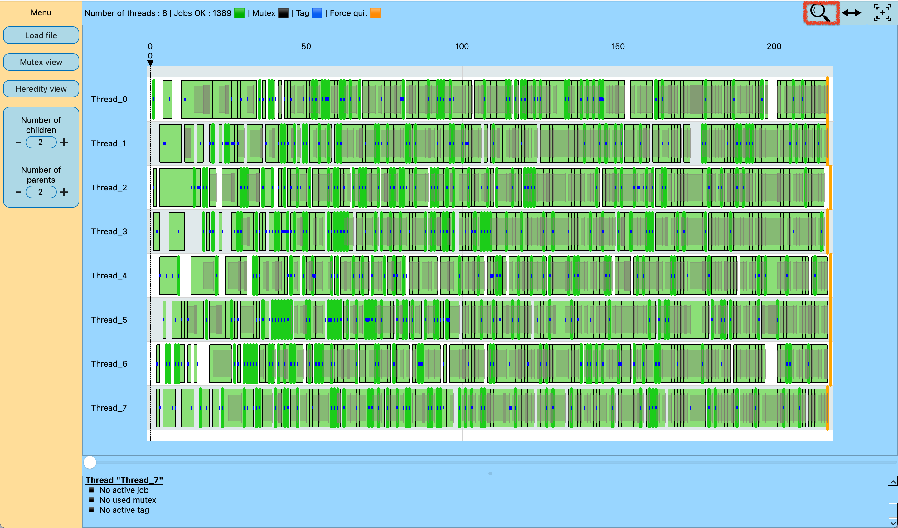


**Animated example:**  


---

#### 3. Left Sidebar

- **Load File Button**  
Loads a JSON file containing the logs to visualize.  


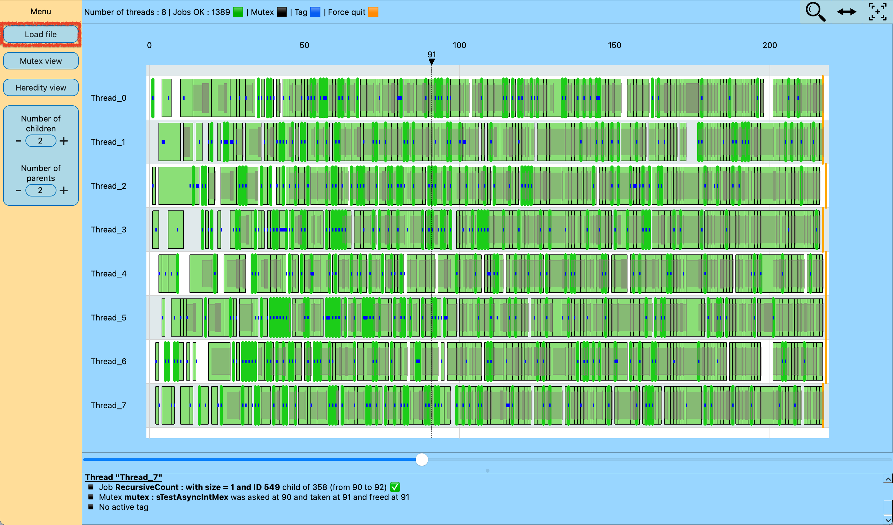


**Animated example:**  


---

- **Mutex View Button**  
Toggles mutex coloring for better visualization of locks and access. 

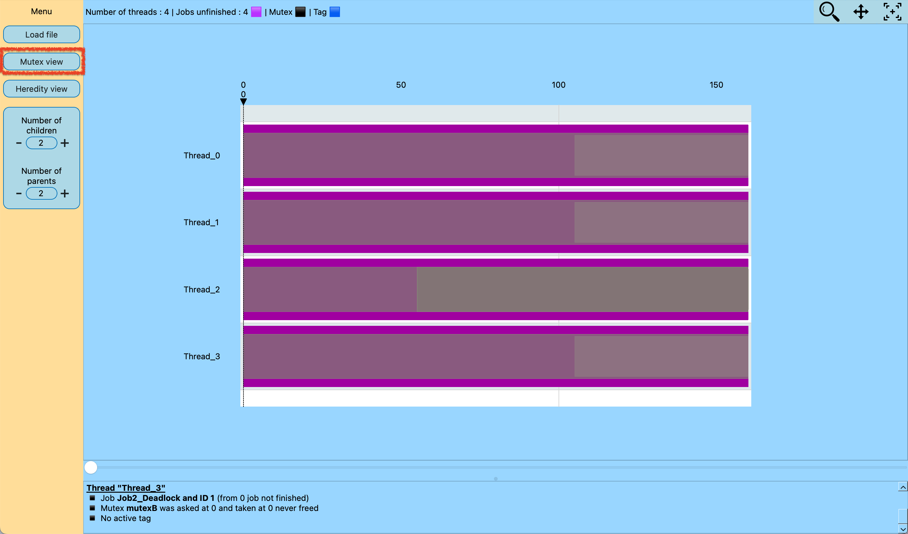

 
**Animated example:**  


---

- **Job Heredity Button**  
Enables or disables displaying parent-child relationships between jobs.  
When enabled, you can adjust how many ascending or descending generations to show.  

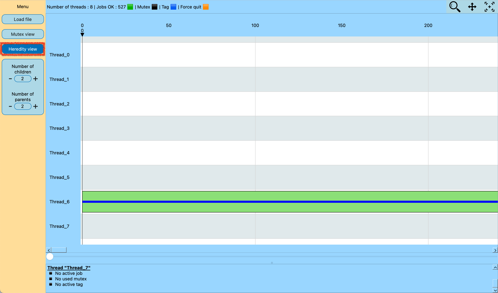


**Animated example:**  


---

#### 4. Bottom Area: Textual Trace

Displays detailed textual information about the execution, updated according to the time slider position.


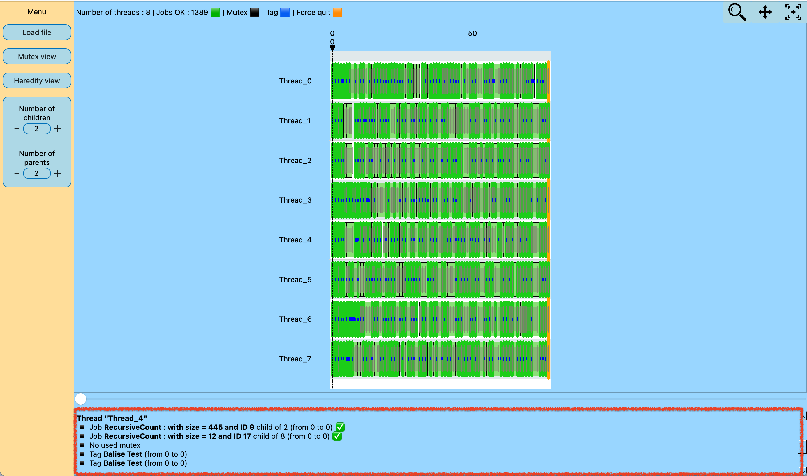

**Animated example:**  


---

Together, these elements provide a powerful and intuitive interface to analyze multi-threaded executions, track job dependencies, visualize mutex usage, and debug complex synchronization issues.


## Licence

