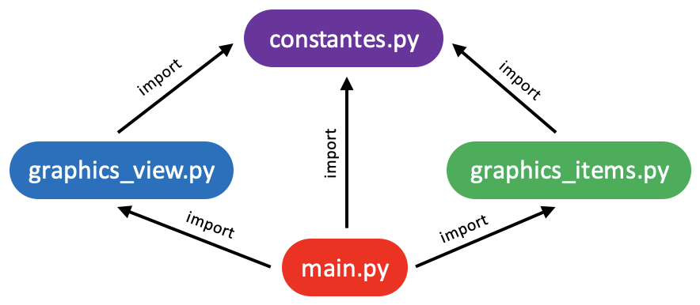
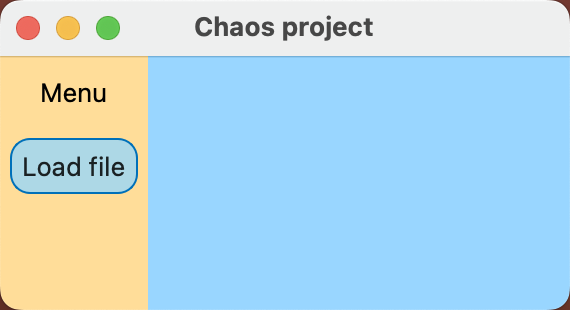

# Rapport de Projet - Multithreading


**Licence 3 - Mathématiques et Informatique**  
**Année Universitaire : 2024-2025**  

---

## Page de présentation

### Membres du groupe :
1. **Emmanuel RENEVIER** - CTO Chief Technical Officer
2. **Florian TALON** - HSP Head of Slides and Powerpoint
3. **Jules RAPOPORT** - LR Linux Representative
4. **Sagar MITTAL** - CEO Chief Executive Officer
5. **Stevenson JULES** - PEME Prompt Engineer & Muscle Expert

### Encadrant(s) :
- Marek BUCKI  

### Date de remise :
[13/06/2025]  

---

## Sommaire

1. [Introduction](#introduction)
2. [Concepts techniques](#concept) 
3. [Instrumentation : API](#api)  
4. [Visualisation : Interface graphique utilisateur (GUI)](#gui)  
5. [Gestion de projet](#gestion)  
6. [Conclusion et perspectives](#conclusion) 
7. [Annexes](#annexes)  


---

## 1. Introduction <a name="introduction"></a>

### Contexte  
Il est très ordinaire pour les personnes âgées d’avoir mal au genou. En effet, cette articulation s’use beaucoup car elle est souvent contrainte au poids du corps.  Il existe une opération de pose de prothèse visant à soulager cette douleur, malheureusement elle est difficile à réaliser parce qu'il existe que 5 tailles de prothèses différentes pour la grande diversité de genoux de la population et demande donc au chirurgien de réaliser une découpe de ce genou avec une très grande précision. Le chirurgien doit donc le jour de l’opération choisir la taille de prothèse et réaliser la découpe. Un grand nombre de patients ayant recours à cette chirurgie se disent insatisfaits, souvent en raison de douleurs chroniques qu’elle peut causer si le chirurgien a mal pu la réaliser.  
C’est ici qu'intervient l’entreprise Twinsight qui est une entreprise qui fournit des solutions dans le domaine biomédical, comme en chirurgie orthopédique. Cette entreprise aide les chirurgiens à choisir la taille de cette prothèse en amont de l’opération, grâce à des outils de visualisations 3D de l’anatomie du patient. Dans le procédé de cette opération, le chirurgien fait des coupes du fémur et du tibia. Le logiciel de Twinsight permet de faire cela. Il utilise le maillage triangulaire afin de visualiser la coupe. Dans un but d'optimisation du temps de calcul, il a été décidé par l’entreprise de paralléliser l’implémentation de l’algorithme de maillage. Cependant le temps de calcul réel de ce nouveau programme n’est pas aussi efficace qu’espéré en théorie. 
En effet, lors de la parallélisation du programme on doit faire attention aux sections critiques du programme qui nécessitent d’être réservées dans un seul thread à la fois (via un Mutex). Afin d'éviter que plusieurs threads du programme touchent aux mêmes objets en même temps et résulter sur une erreur de calcul. On imagine donc facilement qu’une ou plusieurs sections des calculs soit anormalement bloquée ce qui expliquerait pourquoi les threads s’attendent inutilement. L'objectif du projet est donc de concevoir un outil de visualisation des threads en vue d'identifier quels threads ralentissent anormalement le logiciel. 
D’autre part, il n’existe pas d’outil universel de tests/débogage (avec visualisation) de programme qui utilise plusieurs threads. Le but de ce projet est donc d’implémenter un outil de visualisation de ce type de programme afin de déterminer les points de congestions du programme, puis de modifier le programme du client pour rendre la parallélisation réellement efficace. Pour aller plus loin, cet outil de visualisation pourra être utilisable lors de débogage d’autres programmes se servant du multi-threading. 


### Objectifs  
- **Objectif 1** : [Founir une classe de fonctions pour récupérer les informations de parallélisation dans toute code C++]  
- **Objectif 2** : [Exporter les informations dans un fichier de logs JSON sans dépendre de la réussite de l'éxecution du code à analyser]  
- **Objectif 3** : [Founir une interface graphique pratique pour visualiser et identifier les goulots d'étranglement]  

---

## 2. Concepts techniques <a name="concept"></a>

Pour nous familiariser avec le sujet nous avons été amenés à nous intéresser aux notions techniques suivantes: 

Parallélisation : paradigme de programmation qui permet d’exécuter plusieurs instructions à la fois en utilisant des threads. On parle alors de programmation concurrente. 

Thread = Un thread (ou fil d'exécution) est la plus petite unité d'exécution d'un processus. Un processus peut contenir plusieurs threads qui partagent les mêmes ressources, telles que la mémoire et les fichiers ouverts, mais qui s'exécutent de manière indépendante.

Le problème qui survient lorsqu’on l’on fait de la programmation concurrente est que les threads peuvent entrer en concurrence entre eux en tentant d’accéder au même espace mémoire. Ce qui nous amène à la notion d’accès concurrent.
Accès concurrent : L'accès concurrent se produit lorsqu'au moins deux threads ou processus tentent d'accéder à une ressource partagée (par exemple, une variable, un fichier ou une base de données) en même temps. Cet accès peut poser problème si les threads modifient la ressource de manière non coordonnée, car cela peut entraîner des résultats imprévisibles ou des corruptions de données.
Exemple simple : voici un exemple de code qui démontre cela : 
#include <iostream>
#include <thread>

/* Simple function that print "<name> : i"
** where name is a parameter and i ranges from 0 to 4
*/
```c++
void func(std::string name)
{
   for (int i = 0; i < 5; i++)
   {
       std::cout << name << " : "<< i << std::endl;
   }
}

int main()
{
   //First thread --> call to the function func
   std::thread th1(func, "th1");

   //Second thread --> call to the same function func
   std::thread th2(func, "th2");
   th1.join();
   th2.join();


   return 0;
}
```

Et voici différentes sorties de ce programme : 
```bash
th1 : 0
th1 : 1
th1 : 2
th1 : 3
th2 : 0
th2 : 1
th2 : 2
th2 : 3
th2 : 4
th1 : 4
th1 : 0
th1 : 1
th2 : 0
th2 : 1
th2 : 2
th2 : 3
th2 : 4th1 : 2

th1 : 3
th1 : 4
th1 : 0
th1 : 1
th1 : 2
th1 : 3
th1 : 4th2 : 
0
th2 : 1
th2 : 2
th2 : 3
th2 : 4
```

   Le “4” du th1 est à la fin 	      	    problème de flush dans le std::cout à cause des threads th1 et th2
       qui se concurrence sur la même zone mémoire 
         						
Ce qui nous amène à la définition suivante.

Section critique : Une section critique est une partie du code dans un programme multi-thread où une ressource partagée (comme une variable, un fichier, ou une structure de données) est accédée. Pendant l'exécution de cette section, il est crucial que seul un thread ou un processus à la fois puisse y accéder, afin d'éviter des problèmes tels que des conditions de compétition ou des corruptions de données (dans notre exemple la section critique est la fonction “func”).
Nous pouvons même dans le pire des cas bloquer l’exécution d’un programme par un deadlock.

Deadlock (ou interblocage) : Un deadlock est un phénomène qui peut survenir en programmation concurrente. Il se produit lorsque des thread concurrents s'attendent mutuellement, provoquant un interblocage. Un thread peut aussi s'attendre  lui-même. Les threads bloqués dans cet état le sont définitivement.
			 Source Image: https://www.geeksforgeeks.org/introduction-of-deadlock-in-operating-system/
Pour résoudre ce problème nous devons utiliser plusieurs notions définies ci-dessous afin d'autoriser ou non à un thread d’accéder à une zone mémoire à un moment donné

Mutex : un mutex (abréviation de "mutual exclusion") est un mécanisme utilisé pour éviter que plusieurs threads d'un programme accèdent en même temps à une ressource partagée, comme une variable ou un fichier.
Il agit comme un verrou :
Quand un processus ou un thread utilise la ressource, il "verrouille" (lock)  le mutex.
Les autres doivent attendre que le mutex soit "déverrouillé" pour pouvoir accéder à cette ressource.
Cela permet d'assurer que les données restent cohérentes et qu'il n'y a pas de conflits.
Principe de fonctionnement :
Un thread verrouille un mutex :
Le thread appelle lock(), try_lock() ou utilise un gestionnaire comme std::lock_guard ou std::unique_lock pour obtenir un verrou sur le mutex.
Cela garantit une exclusivité : tant qu'un thread détient le mutex, les autres threads essayant de le verrouiller seront bloqués.
Le thread entre dans une section critique :
Une fois le mutex verrouillé, le thread peut accéder en toute sécurité à la ressource partagée (par exemple, un tableau ou une file).
Le thread libère le mutex :
Lorsque le thread a terminé son travail avec la ressource partagée, il libère le mutex en appelant unlock(), ou en laissant le gestionnaire (comme std::lock_guard) sortir de son scope.
Cela permet à d'autres threads de verrouiller le mutex et d'accéder à la ressource partagée.
D'autres threads peuvent maintenant accéder à la ressource :
Lorsque le mutex est libéré, un autre thread bloqué sur le mutex peut le verrouiller et accéder à la ressource.


Méthodes principales de std::mutex :
lock() :
Bloque le thread jusqu'à ce qu'il puisse verrouiller le mutex.
try_lock() :
Tente de verrouiller le mutex sans bloquer. Retourne true si le verrouillage est réussi, sinon false.
unlock() :
Libère le verrou sur le mutex, permettant à d'autres threads de l'utiliser.


Variables atomiques : Une variable atomique est une variable dont les opérations de lecture, d'écriture ou de modification sont garanties atomiques, c'est-à-dire qu'elles sont effectuées comme une seule opération indivisible. Cela signifie qu'aucun autre thread ou processus ne peut observer la variable dans un état intermédiaire ou interrompre l'opération en cours.
Les variables atomiques sont souvent utilisées pour gérer les ressources partagées entre plusieurs threads dans un environnement concurrent, sans avoir recours à des mécanismes explicites de verrouillage comme les mutex.	Caractéristiques principales des variables atomiques :
Opérations atomiques :
Les opérations sur ces variables (lecture, écriture, ou modifications comme l'incrémentation) sont réalisées sans interruption.
Sécurité dans les environnements concurrents :
Elles éliminent les problèmes de conditions de compétition pour certaines opérations simples.
Performance accrue :
En évitant les mutex ou autres mécanismes de synchronisation coûteux, les variables atomiques peuvent offrir de meilleures performances dans certains scénarios.
Dans ce code : std::atomic<int> counter(0);
La variable counter est atomique est contient un int.


Dispatch Queue : C’est la fonction qui répartit les tâches à réaliser entre les différents threads par ordre d’ajout. On dit qu’elle est récursive lorsque le résultat d’une tâche permet d’ajouter de nouvelles tâches.

Variables conditionnelle : une variable conditionnelle (std::condition_variable en C++) est une primitive de synchronisation dans C++ utilisée pour permettre à un thread d'attendre qu'une certaine condition soit remplie, tout en libérant temporairement un verrou associé. Elle est principalement utilisée en combinaison avec un mutex pour coordonner l'accès à des ressources partagées entre plusieurs threads.	Principe de fonctionnement :
Un thread attend une condition :
Il entre en attente en utilisant wait() ou wait_for().
Pendant ce temps, le verrou (mutex) associé est libéré, ce qui permet à d'autres threads de modifier l'état de la condition.
Un autre thread notifie le changement :
Il appelle notify_one() pour réveiller un seul thread en attente.
Ou notify_all() pour réveiller tous les threads en attente.
Les threads réveillés re-testent la condition :
Lorsqu'ils sortent de l'attente, ils doivent vérifier la condition car un autre thread peut avoir modifié l'état avant qu'ils n'obtiennent le verrou.

Méthodes principales de std::condition_variable :
wait() : Suspend l'exécution du thread jusqu'à ce qu'il soit notifié et que la condition soit satisfaite ;
std::condition_variable cv;
cv.wait(lock, [] { return condition; });
Le thread courant s'endort (entre en état d'attente) tant que la fonction lambda (ou le prédicat) retourne false.
Dès que la fonction lambda retourne true, le thread sort de l'attente. La condition est évaluée par la fonction lambda [] { return condition; }.
 La fonction est appelée automatiquement à chaque fois que :
Le thread est réveillé par une notification (cv.notify_one ou cv.notify_all).
Tant que la condition n'est pas satisfaite (false), le thread reste en attente.

wait_for() : Comme wait(), mais avec un délai d'attente maximal. Si la condition n'est pas satisfaite avant l'expiration du délai, il quitte l'attente.
notify_one(): Réveille un seul thread en attente.
notify_all(): Réveille tous les threads en attente.

---

## 4. Visualisation : Interface graphique utilisateur (GUI)
L’interface graphique utilisateur autrement dit la GUI, a pour objectif de rendre visible, lisible et claire les données récoltées par l’API afin que l’utilisateur puisse rapidement comprendre l’exécution de son code en multithreading, pour pouvoir débugger ou optimiser celui-ci.
La partie GUI est constitué de deux partie dépendantes : le code source de l’interface et l’interface elle-même. 

### Le code source de la GUI 
Dans le cahier des charges initiale il nous a été demander d’écrire l’interface graphique utilisateur en langage Python, par contre aucune librairie n’était imposée. Parmi la liste des librairies existante dans Python nous avons choisie PyQt6 qui nous a permis d’avoir un compris entre rapidité de mise en place des d’une fenêtre fonctionnelle (nous avions déjà une base sur laquelle s’appuyer) et l’apprentissage de la librairie. Pour accélérer nos recherches et notre compréhension de la librairie nous avons sollicité l’aide des IA, pour autant chaque ligne de code a été vérifié et/ou écrit par un membre de l’équipe afin de bien comprendre chaque comportement et d’évité d’avoir des artefacts indésirables.

#### Prérequis
Afin que l’interface soit accessible à un maximum d’utilisateur nous avons fait le choix de rendre portable l’utilisation de l’interface à tout système d’exploitation, cependant il est requis d’avoir Python ou Python3 ainsi que Pip ou Pip3 d’installé. Grâce aux machines à notre disposition nous avons eu l’occasion de tester et vérifier l’utilisation de l’interface sur des ordinateurs fonctionnant sous Linux, sous MacOS et sous Windows. Nous avons testé que sur des ordinateurs, aucun teste sur d’autres support n’a été fait, il n’est donc pas exclu que cela fonctionne, nous vous conseillons pour autant d’avoir un écran suffisamment grand pour une meilleur expérience.

#### Mise en place de l’environnement de travail
Afin de pouvoir mettre en place l’environnement de travail il est nécessaire d’avoir Python ou Python3 ainsi que Pip ou Pip3 d’installé, voici la commande (quel que soit le système d’exploitation) permettant de vérifier la présence du langage : `python --version` ou `python3 --version` et `pip --version` ou `pip3 --version`. Dans le cas où rien n’est installé, je laisse à vos soins la démarche d’installation.

Dans la suite des explications tout mention de la commande `python` sera à adapter à vos besoins par `python` ou `python3` selon votre installation de même que `pip` sera à adapter par `pip` ou `pip3`.
L’ensemble des commandes suivante sont à faire dans votre terminal en étant dans le dossier dans lequel se situe les fichiers Python de la GUI.
Afin de s’assurer d’une meilleure reproductibilité du projet nous avons fait un fichier `requirements.txt` qui est laissé aux l’utilisateurs aguerries.

##### MacOS et Linux
En ligne de commande, mettez-vous dans le dossier GUI, dans lequel il y a les fichiers `setup_venv.sh` et `activer_venv.sh`
Tapez la commande :
`./setup_venv.sh`
Cela créera la venv et installera tous les packages de PyQt6.

Dès lors, pour utiliser la venv tapez la commande :
`./activer_venv.sh`
Qui vous indiquera les commandes à exécuter pour activer ou désactiver la venv.

##### Windows
En ligne de commande, mettez-vous dans le dossier GUI, dans lequel il y a les fichiers `setup_venv.bat` et `activer_venv.bat`
Tapez la commande :
` setup_venv.bat `
Cela créera la venv et installera tous les packages de PyQt6.

Dès lors, pour utiliser la venv tapez la commande :
`activer_venv.bat`
Qui vous indiquera les commandes à exécuter pour activer ou désactiver la venv.


#### Architecture des fichiers 
Le code python utilise la notion de classe pour créer l’interface. Il est bien évidement pas question dans cette partie de détailler chaque ligne de code écrite, par contre elle définit l’arborescence des fichiers ainsi que la liste des classes et leur utilité permettant une compréhension globale de la structure de l’interface.

L’ensemble du code Python est divisé en quatre fichiers :
    « constantes.py »
    « graphics_items.py »
    « graphics_view.py »
    « main.py »

 Le fichierA a besoin d’importer le fichierB.


##### « constantes.py »
Ce fichier contient l’ensemble des constantes se trouvant dans l’ensemble des fichiers python de l’interface. 
L’intérêt de ce fichier est de permettre de recenser les variables de l’interface pouvant être adapté. Dans la majorité des cas les noms de constantes sont explicites. Il est composé de six catégories de constantes :
1.	Le nom des clés du dictionnaires dans le fichier Json 
2.	Les couleurs 
3.	Le nom du fichier contenant les Icon ainsi que les noms des Icon elles-mêmes.
4.	Les valeurs par default
5.	Les valeurs de Z (la hauteur dans le plan graphique), plus la valeur est grande plus l’objet est au premier plan
6.	Les emojis

##### « graphics_items.py »
Ce fichier contient l’ensemble des classes des items graphiques. 

`class CurvedArrow` 
Cette classe hérite de la classe `QGraphicsPathItem` une classe de PyQt6. `class CurvedArrow` sert à créer une flèche dont la trajectoire de celle-ci est dessinée à l’aide de courbe de Bézier cubique. De plus lorsque la souris survole l’objet un évènement s’active.

`class HighlightableRect`
Cette classe hérite de la classe `QGraphicsRectItem` une classe de PyQt6. `class HighlightableRect` est une classe parent, créant un rectangle. Lorsque la souris survole le rectangle un évènement s’active.

`class HighlightableRectJob`
Cette classe hérite de la classe `HighlightableRect` précédemment décrite. `class HighlightableRectJob` permet de spécifier l’évènement lorsque la souris survole le rectangle, et elle ajoute aussi un évènement lors du clic de la souris sur l’objet.

`class HighlightableRectQuitting`
`class HighlightableRectMutex`
`class HighlightableRectTag`
`class HighlightableRectDeadlock`
L’ensemble de ces classes hérite de la classe `HighlightableRect` précédemment décrite. Ces classes permet de spécifier l’évènement lorsque la souris survole le rectangle.

`class TriangleSlider`
Cette classe hérite de la classe `QGraphicsPolygonItem` une classe de PyQt6. `class TriangleSlider` est une classe créer le triangle qui est associer à un slider. Lorsque l’on maintient le triangle avec la souris et que l’on bouge de droite à gauche alors celui-ci vient mettre à jour la valeur du slider, qui lui-même met à jour la position du triangle et des objets associés.

##### « graphics_view.py »
Ce fichier contient l’ensemble des classes lié à la vue et à la scène graphique.

`class ClickScene`
Cette classe hérite de `QGraphicsScene` une classe de PyQt6. `class ClickScene` définit la scène graphique dans laquelle les objets graphiques sont dessinés. L’intérêt de cette classe est de pouvoir mettre en place des évènements de souris lorsque l’on clique sur aucun objet de la scène graphique ou sur des objets différents.

`class ZoomView`
Cette classe hérite de `QGraphicsView` une classe de PyQt6. `class ZoomView` définit la vue graphique dans laquelle les objets graphiques sont dessinés. L’intérêt de cette classe est de pouvoir créer un zoom/dézoom global pour garder une cohérence dans les transformations.

##### « main.py »
Ce fichier est le fichier principal de l’ensemble de la GUI il utilise tous les précédents fichiers pour permettre de créer l’interface utilisateur. Il contient quatre fonctions et deux classes ainsi que la fonction `main` qui exécute l’ensemble du fichier.

`create_button`
`create_image_button`
`increment_button`
Ce sont trois fonctions qui permettent de créer des boutons avec chacun ses spécifications.

`create_zoomed_copy`
Cette fonction créer des copies d’objets de classe `HighlightableRect`.

`class MainWindow`
Cette classe hérite de la classe `QMainWindow` une classe de PyQt6. `class MainWindow` est la classe créant la fenêtre initiale ainsi que les fonctionnalités présente dès l’initialisation de la fenêtre tel que le bouton de chargement des fichier Json. C’est la classe qui est appelé lors de l’exécution de la fonction `main` du fichier.

`class DispalyJsonData`
Cette classe est la classe principale qui est appelé lors du chargement d’un fichier Json. Elle ajoute les boutons nécessaires, créer la zone graphique, chapote l’affichage textuel et gère la légende de la zone graphique.

#### Démarrage de la GUI
Pour faire fonctionner la GUI il est nécessaire de créer et d’activer la venv (voir #### Mise en place de l’environnement de travail).
Une fois la venv activé tapez la commande : 
`python3 main.py`

Lors de l’exécution de cette une fenêtre s’ouvrira, la GUI sera alors prête à être utiliser.

### L’interface
L’interface s’ouvre sur une fenêtre simple avec très peu de chose, un titre, deux zones graphiques. Une plus central mais vide, et une seconde, à gauche nommé le menu, avec pour seul bouton `Load file` qui permet l’ouverture d’un fichier Json. 



C’est alors que tout peut commencer, un monde nouveau s’ouvre à vous !! 

#### L’organisation de la fenêtre
La fenêtre s’organise en six zones :
1. Le titre de la fenêtre (si vous êtes en plein écran, celui-ci ne sera pas visible), a changé, il affiche maintenant le chemin d’accès du fichier que vous avez choisie.

#PHOTO

2. Le menu, déjà présent avec le bouton `Load file` mais cette fois plusieurs nouveaux bouton se sont ajoutés.

#PHOTO

3. La légende, situé en haut à gauche de la zone central, il sert à ajouter les informations nécessaires à la lecture de la zone central.

#PHOTO

4. La zone de gestion de la loupe et du zoom, situé en haut à droite de la zone central, il concentre l’ensemble des boutons que l’utilisateur à besoin pour gérer et utiliser la loupe et le zoom.

#PHOTO

5. La zone centrale, ou zone graphique, constitue la zone la plus importante de la GUI, c’est dans celle-ci que les informations seront rendues visuelles pour l’utilisateur. Une majorité des interactions se fera dans cette zone.

#PHOTO

6. L’affichage textuelle, situé juste en dessous de la zone centrale, complétera les informations visuelles de la zone centrale en apportant du détail.

#PHOTO

#### Fonctionnalité de la GUI
Dans cette partie nous allons prendre le temps de détailler pas à pas l’ensembles des fonctionnalités implémentées dans la GUI afin de pouvoir lire et comprendre son utilisation.

L’objectif du projet et de visualiser un programme multi-threadé et d’étudier son comportement lors de l’exécution de celui-ci. Pour représenter le travail d’un thread en fonction du temps nous avons créé un graphique avec le temps en axe des abscisses, et les threads en axe des ordonnées. Cette représentation apporte plusieurs avantages : l’écran d’ordinateur étant souvent plus large que haut, cela permet d’avoir une représentation plus globale de notre graphique, de plus, comme le graphique introduit une notion de temporalité, celle-ci est plus intuitive en représentation horizontale que verticale, rendant la lecture graphique plus naturelle. 
Chaque thread est défini par un nom et un id, dans l’affichage, seul le nom est utilisé, car beaucoup plus lisible par l’utilisateur. 
La time line est représenté par des valeurs en millisecondes. 

#PHOTO thread + time line

Sachant que la temporalité d’une exécution de programme change en fonction de chaque programme il est évident que dans une majorité des cas l’entièreté de la time line ne pourra pas être afficher dans la zone graphique, il pour autant important de pouvoir avoir une vision global de l’exécution, pour ce faire nous avons implémenté un zoom sur la zone centrale. Pour l’utiliser, lorsque la souris est sur la zone graphique, l’utilisateur doit maintenir enfoncé la touche commande (Cmd ⌘) sous MacOs ou la touche contrôle (Ctrl ^) sous Windows tout en utilisant la molette de la souris pour zoomer ou dézoomer. Afin d’avoir un zoom plus adaptatif au besoin de l’utilisateur nous avons créé deux modes de zoom : 
1. Un zoom/dézoome verticale et horizontale, permettant de conserver l’échelle de temps. 
2. Un zoom/dézoome strictement horizontale, permettant d’avoir une vue globale plus adapté.
Pour changer de mode de zoom l’utilisateur n’a besoin que de cliquer sur le bouton zoom #VOIR PHOTO. Les deux modes de zoom peuvent être mélangé pour que l’utilisateur puisse adapter le zoom à ses besoins. Pour autant, si l’utilisateur souhaite revenir au graphique initial, c’est possible, un bouton sert exclusivement à cet effet #VOIR PHOTO.

#PHOTO zoom + touche commande ou contrôle + molette souris

Maintenant que l’on a la lecture graphique ainsi que sa visibilité, introduisons les taches que les threads peuvent avoir. Chaque thread peut avoir une liste de tâche à effectuer, chaque tâche sera nommée « job », il est représenté par un rectangle et est définit par son nom, son id, l’id de son parent s’il en a un, un temps de début d’exécution, un temps de fin d’exécution, un état (OK ou KO) et s’il est KO, alors un message qui en définit la raison.

#PHOTO info job

Afin de différentier d’un simple coup d’œil un job OK d’un job KO nous avons choisie de mettre en vert un job OK et en rouge un job KO. Ce choix de couleur et rappelé dans la légende en précisant aussi le nombre de job OK et le nombre de job KO.

#PHOTO job OK job KO + légende

Pour autant la visualisation des jobs n’est pas si simple, plusieurs problèmes se pose :
1. Lors d’un export en temps réel un job peu n’avoir pas fini de travailler. Pour différentier un job fini d’un job non fini, là encore un choix de couleur est fait, et la légende nous le rappel : ils sont en violet. La légende nous précise aussi le nombre de ces jobs.
2. Un job pour être exécuté en moins de 1 ms, autrement dit, la durée en ms d’exécution est de 0 ms. Or comme la largeur d’un rectangle représentant nos jobs dépend de la duré d’exécution, notre rectangle aura une largeur de 0, et ne serais alors pas visible sur la GUI. Pour gérer ce problème, les rectangles des jobs instantanés ont une bordure plus imposante, sont plus haut, et ont une couleur plus vive.

#PHOTO job non fini + légende, job instante KO ou OK 

Lors d’une exécution, un thread peut, pour diverse raison, arrêter de travailler, auquel cas, nous représentons la situation par un rectangle orange. Cette situation s’appelle un « quitting » et est définit par un message définissant la raison.

#PHOTO quitting

Un des problèmes des programmes en multithreading est la gestion des mutex, il était donc très important de réussir à représenter l’utilisation de mutex. Un mutex est définit par son nom, le temps auquel le thread demande le mutex, le temps auquel le thread a obtenu le mutex et le temps ou le thread libère le mutex. Pour représenter toutes ces informations, nous avons fait le choix de faire de rectangle par mutex, un premier qui représente le temps allant de « j’ai besoin du mutex » à « j’ai le mutex » et un second rectangle plus haut, allant de « j’ai le mutex » à « je fini d’utiliser le mutex ». Pour représenter le mutex nous avons choisi la couleur noire, cependant nous avons mis une opacité à ceux-ci afin que lorsqu’un mutex est demander pendant l’utilisation d’un autre mutex alors la superposition d’opacité nous fait comprendre une superposition de mutex.

#PHOTO de mutex 
Cependant ce choix unique de couleur de mutex ne permet pas de différentier le nombre de mutex différent que le programme utilise. Nous avons donc ajouté un bouton `Mutex view` qui vient donner une couleur différente à chaque mutex ayant un nom différent, permettant ainsi de mieux comprendre quel mutex est utilisé. ATTENTION !! La gestion de ces couleurs se fait à l’aide d’une liste fini de couleur différente (20 couleurs initialement), ainsi si le nombre de mutex de nom différent est supérieur au nombre de couleur de la liste alors, deux mutex peuvent avoir la même couleur associée. Il est très facile d’ajouter des couleurs au besoin de l’utilisateur, les modifications se font que dans le fichier « constantes.py ».

#PHOTO mutex view + liste couleur constante

Pour pouvoir mieux cibler les bouts de code qui sont exécuter nous avons rajouté des balises instrumentant le code de l’utilisateur, ces balises nommées « tag » sont définie par un nom, un temps de début et un temps de fin. Ces tags sont représentés par des rectangles bleu qui forme une ligne. Si un tag n’a pas pu finir d’être exécuté alors, le tag aura alors une couleur violacée au lieu de sa couleur bleu habituel.

#PHOTO tag + tag non fini

La hantise de tous les développeurs qui travaille en multithreading est le « deadlock ». Pour le signaler nous avons pris le parti encore une fois, de dessiner un rectangle au temps du deadlock, celui-ci est représenté en marron, et lorsqu’il y en a un, la légende l’indique, avec sa couleur associée.

#PHOTO deadlock

Pour que chaque objet dessiné dans la vue puisse fournir des informations précisent sans surcharger le graphique, nous avons fait le choix d’implémenter un « tool tip » qui s’affiche à côté de la souris lorsque la souris survole un objet.

#PHOTO tool tip

Malgré toutes les précautions prises, certaines informations ne peuvent pas être lu sur le graphique, par exemple supposons que deux jobs instantanés d’un même thread s’exécutent au même temps, alors dans le graphique nous ne pouvons voir et sélectionner que le dernier job exécuté, il y a donc ici une perte d’information. Pour autant il est très difficile de faire en sorte que ce soit visible sur le graphique, une solution visuelle n’est donc pas envisageable. Pour pallier à ce problème nous avons créé un affichage textuelle situé sous la zone graphique, qui a temps sélectionné à l’aide du slider situé dans la zone graphique vient afficher l’ensemble des données à ce temps. 
En plus de permettre une lecture en cas de superposition d’objet, cela permet aussi de comparer à un temps le travail de chaque thread, car l’affichage liste l’ensemble des travaux effectué pour chaque thread. 
De plus lorsqu’il y a un deadlock, l’affichage textuelle notifiera constamment la présence de celui-ci.

#PHOTO affichage textuelle + slider triangle + slider + message de deadlock

Pour compléter le manque de visibilité nous avons attaché une loupe au slider. La gestion de la loupe se fait à l’aide des boutons loupe situé en haut à droite de la zone graphique.

#PHOTO loupe + boutons loupe

Pour mettre en avant un job ainsi que sa lignée parentale, ses parents et ses enfants, il est possible à l’utilisateur de cliquer sur un job en particulier, mettant en avant le job sélectionné en mettant son contour en pointillé, et en opacifiant l’ensemble des jobs qui ne sont ni parent ni enfant de celui-ci. Pour garder une lisibilité, nous avons fait le choix de limiter le nombre de prédécesseur et le nombre descendant affichés. Cette limite est modifiable à l’aide du bouton adéquat.

#PHOTO job select + bouton nb de parent et enfant

Pour rendre la lignée du job sélectionné encore plus lisible, il a été choisi d’ajouter des flèches entre un parent et ses enfants. Cependant comme cela peut rendre lourd la lisibilité du graphique il a été choisi que les flèches peuvent à la guise de l’utilisateur être cacher ou non à l’aide du bouton « Heridity view ».

#PHOTO bouton hérédité

Maintenant vous connaissez tout de la GUI, à vous de la prendre en main, de vous familiariser avec pour en faire votre outil favori de debug ou d’optimisation de programme en multithreading !!

Chaque outil de la GUI a été réfléchie pour permettre une meilleure compréhension du programme analysé, pour aider à l’optimisation ou au debug de celui-ci. Cependant le manque de temps rend la GUI améliorable, par exemple, l’utilisation de la loupe mélanger à l’utilisation du clic d’un job pour visualiser sa lignée n’est pas fonctionnel et comporte des incohérences, ce mélange de fonctionnalité est donc, en l’état, déconseillé. De même, d’autres fonctionnalités plus ergonomiques peuvent être ajouter afin d’améliorer « l’expérience utilisateur ».

---

## 5. Gestion de projet <a name="gestion"></a>

### Mode de fonctionnement 
Le sujet présentant beaucoup d’inconnues dès le début, nous avons opté pour un fonctionnement agile et dynamique pour ne pas se retrouver limités par une organisation trop lourde. Pour cela, nous avons décidé de nous répartir en deux équipes : une équipe GUI qui aura la tâche d’implémenter l’interface graphique et une équipe API qui se charge de la création d’un système de journaux appelés “logs” pour récupérer les informations nécessaires à la visualisation du problème.
Afin de structurer notre avancée semaine après semaine, nous avons organisé une à deux réunions hebdomadaires avec notre encadrant pour pouvoir échanger sur notre solution, consulter les attentes du client et débattre du travail à venir.
Ce à quoi s’ajoute une réunion d’équipe en fin de semaine pour clôturer l’avancée des derniers jours, discuter des tâches à effectuer et se les répartir ainsi que fusionner les branches du dépôt pour repartir sur une pré-version stabilisée pour la semaine suivante
Les deux équipes se sont vite retrouvées dans un schéma d’interdépendance où il fallait communiquer quotidiennement les besoins des uns et des autres. Cela fonctionne bien avec notre organisation agile car, travaillant tous ensemble sur place chaque jour, nous pouvions nous consulter directement. Il s’agira pour nous de faire le point tous les matins sur les avancées de chacun sur les tâches qu’il a à réaliser voir d’expliquer les difficultés que l’on peut rencontrer sans pour autant rentrer sur des aspect techniques, le but étant que la réunion dure environ un quart d’heure pour éventuellement adapter notre organisation. En effet, cela permet de nous accorder suffisamment de flexibilité pour nous réorganiser si il s’avère que nous avons mal mesuré la difficulté que peut ou pas représenter une certaine tâche et donc d’adapter nos moyens en fonction. 
Les arbitrages sur les décisions et choix critiques à prendre pour le projet se sont aussi pris à l'unanimité à la suite des consultations de toute l’équipe.

### Outils de plannification
Nous avons décidé de centraliser tous nos outils de gestion des tâches par l’outil Jira qui nous a servi à :
visualiser notre flux de travail avec un système de post-it virtuel réparti en quatre colonnes (ToDo, En Cours, Terminé, Abandonné).
suivre la chronologie et les dates limites imposées via un système de diagramme Gantt
alimenter un backlog pour répertorier notre avancée quotidienne ainsi que les interrogations qui peuvent survenir et les questions à poser à notre encadrant/client.
En procédant de cette façon avec Jira, nous avons pu avoir une organisation efficace et précise pour la répartition des tâches d’abord, mais aussi et surtout pour la gestion du temps car notre projet se limite à quelques semaines seulement.

### Roadmap
Pour arriver à notre objectif nous avons procédé aux étapes suivantes (3 et 4 optionnelles) : 

ETAPE 0 : (semaine de décembre)
Nous former à la programmation C++ et à la librairie d’interface graphique (déjà commencé cette semaine).
Analyser le code C++ fournit à fin d’imaginer une solution pour l’étape suivante.
Mise en place de tout l'environnement (gitlab, jira, canal de discussion, google drive).
Préparation soutenance de décembre.

ETAPE 1 : 
Décider collectivement d’un formatage des données de journalisation qui sera dans un fichier (certainement au format .json).
Création de deux équipes : 
Réaliser la journalisation des tâches réalisées par chaque thread et mettre en lumière quels thread est mis en pause en raison d’un verrou (lock). (pour cela il faudra modifier le format de sortie des logs dans la lib DispatchQ).
Concevoir une interface graphique python à l’aide de la libraire PyQt6 à partir d’un fichier de journalisation.
A l’issue de cette étape nous serions normalement capables de visualiser les “goulots d’étranglements” des threads. 

ETAPE 2 :
Affiner l’interface graphique afin de fournir les outils essentiels à la bonne visualisation de la parallélisation de notre programme. Établir un ensemble de fonctionnalités “user-friendly” afin de faciliter la prise en main par l’utilisateur
Rendre la création de logs efficace et prenant en compte les erreurs de segmentation en cas de deadlock pendant l'exécution du programme.

ETAPE 3 :
Consultation du code client afin de tester notre programme en conditions réelles et recherche/débug du problème initial.

ETAPE 4 :
Cette étape est à faire si nous avons fini les étapes précédentes avant la fin du projet. Il s’agit de faire la preuve formelle de correction de programme multi threader.
